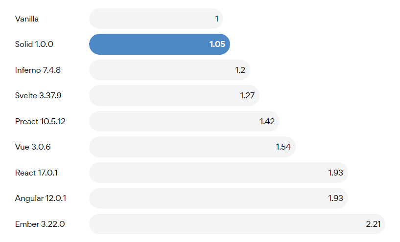

# 对不起 React，我变成了你想要的样子

上个星期的周会上，一个同事聊到能不能回归到 jquery 的时代，直接操纵 dom 来实现性能的优化。想到 jquery 代码维护的恐怖难度，这恐怕并不现实。而听到这一观点的时候，我的脑中便第一时间蹦出 [Solidjs](https://www.solidjs.com/) 的影子，

本文代码同步更新到[仓库](https://github.com/Flower-F/solidjs-examples)，你可以在 [starter](https://github.com/Flower-F/solidjs-examples/tree/starter) 分支直接获取配置好的开发环境（Vite + UnoCSS + Solidjs）。

# 什么是 Solidjs

和 React、Vue、Svelte 一样，Solidjs 是一款新兴的 Web 开发框架/库。

# 为什么需要 Solidjs

既然已经有了 Vue、React，那么为什么还需要 Solidjs 呢？原因主要有以下几点：

- 更完备的响应式系统：很多人吐槽的一点是 React Hook 的响应式局限性非常大，比如 Hook 不能条件式调用、useEffect 的依赖难以准确识别等。而 Solidjs 通过在 getter 中进行依赖收集，在 setter 中触发依赖更新的方式实现了依赖的收集，使得响应式系统的局限性更少。
- 多余的心智负担：React Hook 常常需要开发者使用 memo、useMemo 和 useCallback 进行手动优化。尽管 React 团队正在试图通过 [React Forget](https://www.youtube.com/watch?v=lGEMwh32soc) 来弥补原先的缺陷，但是因为 jsx 语法的灵活性，想要猜测开发者的意图并不简单。举个例子，一个条件渲染在 React 中可能就有很多种实现方法。另一方面，memo 本身也会带来一定的性能开销，如何平衡这笔性能开销和重新创建的开销也不是一个简单的事情，因此想要对 React 进行编译时优化并不轻松。而 Solidjs 通过结合传统 jsx 和 vue 的模板语法，通过依赖追踪和按需引入的方式提供了充分的编译时优化。
- 性能：Solidjs 直接标榜自己的性能是对标原生 js 的，在 [js framework benchmark](https://krausest.github.io/js-framework-benchmark/index.html) 中这一点也得到了证实。
- 没有历史负担。React 为了兼容 class 组件使得代码变得越来越臃肿，越来越难以理解，Vue2 到 Vue3 的大幅度更新使得社区不少开发者感到为难。而 Solidjs 作为新生儿可以从零实现，不需要顾虑历史因素，所以源码实现得更为简单易懂，想补充新特性也没有历史包袱。

# Solidjs 为什么这么快



由图中可以看出，Solidjs 在性能方面几乎是碾压其他 Web 框架，甚至直逼原生 js。原因大致有以下几个方面：

- 结合了 jsx 和模板的利弊。既保留了 jsx 语法的灵活性，利用了 React 庞大的社区生态，又通过一些模板语法，如上面提到的 Show、Switch、For 等等实现了编译时优化和按需引入。
- 在真实 DOM 上直接做 diff。类似于 Svelte，Solidjs 通过直接在原生 DOM 节点上进行 diff 算法，略过新旧虚拟 DOM 树比较的中间步骤，从而实现了高性能。关于虚拟 DOM 带来的额外开销，以及为什么虚拟 DOM 在过去一直被错误地视为一种宝物，可以看 Svelte 官网的[这篇文章](https://svelte.dev/blog/virtual-dom-is-pure-overhead)。
- Tree Shaking。无论是 Vue 还是 React，只要你用到了框架其中的某些功能，就需要将整个包进行全量打包，但是对于 Solidjs，它只会去打包你所使用到的部分，从而使得打包出来的代码体积非常轻量。

# 怎么用

下面会通过一系列例子教会你快速入门 Solidjs，当然前提是你最好有一定的 React Hooks 使用经验，这样你也能更直观地感受到 Solidjs 相比于 React 的优势。

## Hello World

这是一个无需解释的例子。
```tsx
const App: Component = () => {
  return <div>hello world</div>;
};
```

## Signal

Signals 实际上就是类比于 React 里面 state 的概念。只不过不同之处是它的返回参数第一个是一个 getter，第二个是一个 setter，两个都是函数。
```tsx
const SignalExample: Component = () => {
  const [count, setCount] = createSignal(0);
  setInterval(() => setCount(count() + 1), 1000);

  return <div>定时器：{count()}</div>;
};
```

更为神奇的是，这种响应式是可以传递的，这有点类似于 vue 中 computed/watch 的概念。

```tsx
const SignalExample: Component = () => {
  const [count, setCount] = createSignal(0);
  const doubleCount = () => count() * 2;

  setInterval(() => setCount(count() + 1), 1000);

  return (
    <div>
      <div>定时器：{count()}</div>
      <div>双倍计数：{doubleCount()}</div>
    </div>
  );
};
```

## Effect

Effect 实际上就是类比于 React 里面 useEffect 的概念，但是它的使用更加符合直觉的编程思维。你不需要声明依赖，因为 Solidjs 自动帮你跟踪了。
```tsx
const EffectExample: Component = () => {
  const [count, setCount] = createSignal(0);
  setInterval(() => setCount(count() + 1), 1000);

  createEffect(() => {
    console.log('定时器计时', count());
  });

  return <div>hello world</div>;
};
```

## Memo

不要因为 React 的存在导致你一看到 memo 这个单词就害怕，事实上在 Solidjs 里面 memo 也不需要你手动进行依赖追踪。通过 createMemo 方法，你的计算结果将会被 Solidjs 缓存起来，因此页面整体的重新计算速度会非常快。

```tsx
function fibonacci(num: number): number {
  if (num <= 1) return 1;

  return fibonacci(num - 1) + fibonacci(num - 2);
}

const MemoExample: Component = () => {
  const [count, setCount] = createSignal(10);
  const fib = createMemo(() => {
    console.log('calculate');
    return fibonacci(count());
  });

  return (
    <div>
      <button onClick={() => setCount(count() + 1)}>Count: {count()}</button>
      <div>
        1. {fib()} {fib()} {fib()} {fib()} {fib()}
      </div>
      <div>
        2. {fib()} {fib()} {fib()} {fib()} {fib()}
      </div>
      <div>
        3. {fib()} {fib()} {fib()} {fib()} {fib()}
      </div>
      <div>
        4. {fib()} {fib()} {fib()} {fib()} {fib()}
      </div>
      <div>
        5. {fib()} {fib()} {fib()} {fib()} {fib()}
      </div>
    </div>
  );
};
```

## Show

Show 就是一种条件渲染方式，类似于 vue 中的 v-show。

```tsx
const ShowExample: Component = () => {
  const [login, setLogin] = createSignal(false);
  const toggle = () => setLogin(!login());

  return (
    <Show when={login()} fallback={<button onClick={toggle}>Log in</button>}>
      <button onClick={toggle}>Log out</button>
    </Show>
  );
};
```

## Switch

除了 Show 之外，另一种条件渲染的方式叫做 Switch，表示根据不同的条件进行渲染。

```tsx
const SwitchExample: Component = () => {
  const [x, setX] = createSignal(7);

  return (
    <div>
      <button onclick={() => setX(x() + 1)}>click me to +1</button>
      <Switch fallback={<p>{x()} is between 5 and 10</p>}>
        <Match when={x() > 10}>
          <p>{x()} is greater than 10</p>
        </Match>
        <Match when={5 > x()}>
          <p>{x()} is less than 5</p>
        </Match>
      </Switch>
    </div>
  );
};
```


## For

For 就是一种列表渲染方式，类似于 vue 中的 v-for。

```tsx
const ForExample: Component = () => {
  const [personList] = createSignal([
    { id: '1', name: 'Tom' },
    { id: '2', name: 'Amy' },
    { id: '3', name: 'Jack' }
  ]);

  return (
    <ul>
      <For each={personList()}>
        {(person, i) => (
          <li>
            {i() + 1}: {person.name}
          </li>
        )}
      </For>
    </ul>
  );
};
```

## Dynamic

这个也就是我们平常所说的动态组件，该特性在 vue 和 react 中也都有相应的支持，这里不多做介绍。

```tsx
const DynamicExample: Component = () => {
  const [selected, setSelected] = createSignal('red');

  return (
    <>
      <select value={selected()} onInput={e => setSelected(e.currentTarget.value)}>
        <For each={Object.keys(options)}>{color => <option value={color}>{color}</option>}</For>
      </select>
      <Dynamic component={options[selected() as keyof typeof options]} />
    </>
  );
};
```

## Popup

Popup 类似于 React 中的 createPortal，基本上就是完全为了弹窗组件设计的。通过 Popup 可以解决掉 z-index 有时候不生效，以及不方便维护的问题。

```tsx
const DynamicExample: Component = () => {
  const [selected, setSelected] = createSignal('red');

  return (
    <>
      <select value={selected()} onInput={e => setSelected(e.currentTarget.value)}>
        <For each={Object.keys(options)}>{color => <option value={color}>{color}</option>}</For>
      </select>
      <Dynamic component={options[selected() as keyof typeof options]} />
    </>
  );
};
```

限于篇幅原因，关于基本使用的介绍就说这么多，其实这里还有很多 solid 的特性没有涉及到，比如 Error Boundary、Suspense 等等。感兴趣的朋友们可以自己去[官网教程](https://www.solidjs.com/tutorial/introduction_basics)查看。

# 如果没有 Solidjs，能使用 Solidjs 吗

Solidjs 虽然听起来好像哪里都很好，但是目前而言它有一个致命的缺点，那就是生态很差。对比起 React、Vue，甚至新宠 Svelte 来说，Solidjs 的生态甚至连萌芽都还没有开始，就连它的脚手架 [solid-start](https://github.com/solidjs/solid-start) 现在也还很不完善。另一方面，对于不喜欢模板语法的开发者来说，在 jsx 中引入模板也会降低开发者的开发体验。同时，虽然 Solidjs 作为一个集大成者，融合了多个 Web 框架的优缺点，但这也容易导致自己的定位不准，以至于变成四不像的样子。这些缺点使得 Solidjs 目前确实无法用于生产环境，但这并不意味着我们就不能在日常开发中利用 Solidjs 的一些优点与思想。

**有没有一种可能，在 React 中写 Solidjs，这样我们是不是就不需要自己进行依赖的手动声明了呢？**

在社区中，其实已经有人开始做这件事情了，而且它的名字也浅显易懂，就叫做 [solid-react](https://www.npmjs.com/package/solid-react)，尽管它现在甚至还没达到 30 个 star，但作为一个实验性项目已经具有了一定的前瞻性，我们也可以在它提供的 [codesandbox](https://codesandbox.io/s/solid-react-rymhr6?fontsize=14&hidenavigation=1&theme=dark&file=/src/App.js) 感受一下，在不需要自己手动管理依赖的时候，书写 Hook 是多么愉快。

整个库就只有一个[核心文件](https://github.com/nanxiaobei/solid-react/blob/main/src/index.tsx)，根据作者在掘金上发表的[文章](https://juejin.cn/post/7083566878085349384)，我们可以简单了解一下里面 useSignal 的实现原理。

- 首先我们要弄明白为什么 Solidjs 中 createSignal 传回的第一个参数需要是一个 getter 函数，而不能像 React 一样只是简单地返回一个值。原因很简单，Solidjs 用的是静态模板，在静态模板之下函数不会像在 React 中动态 jsx 那样多次运行。因此要实现响应式，必须依赖于一些 js 现有的特性，比如说在 Vue2 中通过 defineProperty 拦截 data 中的属性，Vue3 中 通过 Proxy 拦截，所以代码要写成 this.xxx.value 的形式；另一种方式就是像 Solidjs 这样依赖于函数实现。
- 其次需要了解的是如何实现 value 的部分更新，这里用到的方法是将 value() 包装为一个组件，但是它只展示数据，从而利用组件的特性实现细粒度的更新

```tsx
function useSignal(val) {
  const valRef = useRef(val);
  // 收集更新操作，因为 useSignal 可能会被多次使用，所以需要集中回收所有的更新操作，否则只会处理最后一处的数据
  const listeners = useRef([]);

  // 将数据包装为一个组件，利用组件的特性实现细粒度的更新
  const Render = () => {
    const [value, setValue] = useState(valRef.current);

    useEffect(() => {
      // 收集 setState，也就是更新函数
      listeners.current.push(setValue);
      return () => {
        listeners.current.splice(listeners.current.indexOf(setValue), 1);
      };
    }, []);

    return value;
  };

  const getter = () => {
    try {
      // 这是一个 hack 的做法，通过尝试执行一个 Hook，可以判断出这是在 Hook 环境下还是其他环境下
      useState();
      return <Render />;
    } catch (e) {
      return valRef.current;
    }
  };

  const setter = payload => {
    listeners.current.forEach(listener => {
      // 调用更新函数进行处理
      listener(prev => {
        valRef.current = typeof payload === 'function' ? payload(prev) : payload;
        return valRef.current;
      });
    });
  };

  return [getter, setter];
}
```

# 总结

总的来说，Solidjs 虽然目前生态并不够活跃，但是在某些方面已经具备了超越一些 Web 框架的趋势。真实 DOM 在虚拟 DOM 热度爆表的几年中消失不见，又会否在几年后，随着 Svelte 和 Solidjs 的出现重回江湖，这也是一个有趣的问题。另外 Solidjs 其实也并不只是适用于 Web 端，它也可以自己实现渲染器接入，但是在传统观念中，似乎没有虚拟 DOM 就无法实现跨平台了，那这是否又会给跨端的未来带来一些新的灵感与启发，我们拭目以待。
